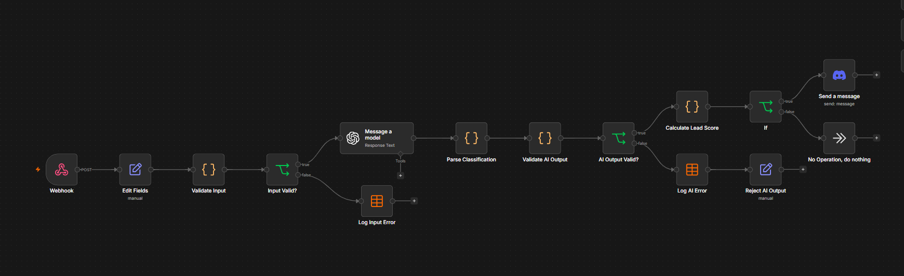
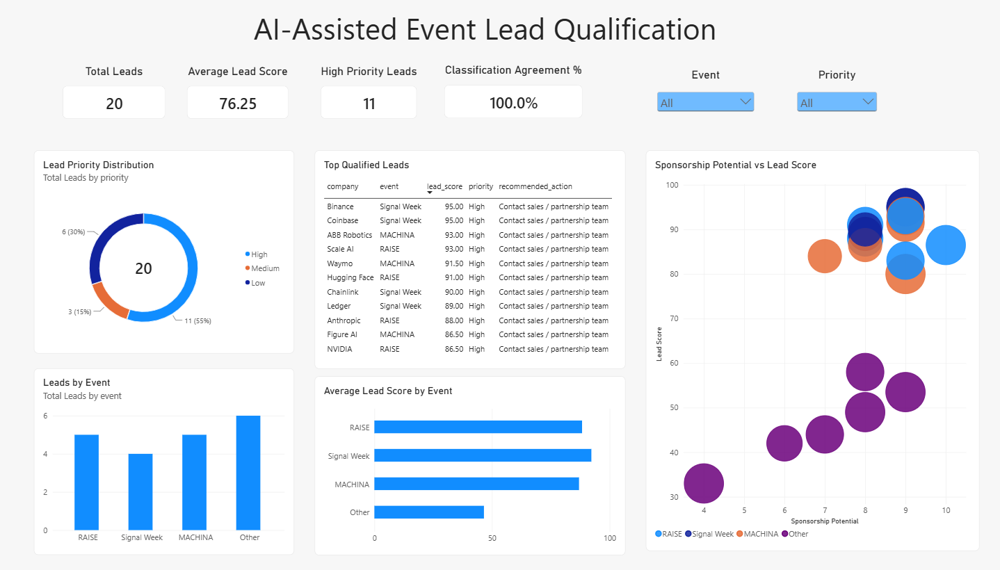
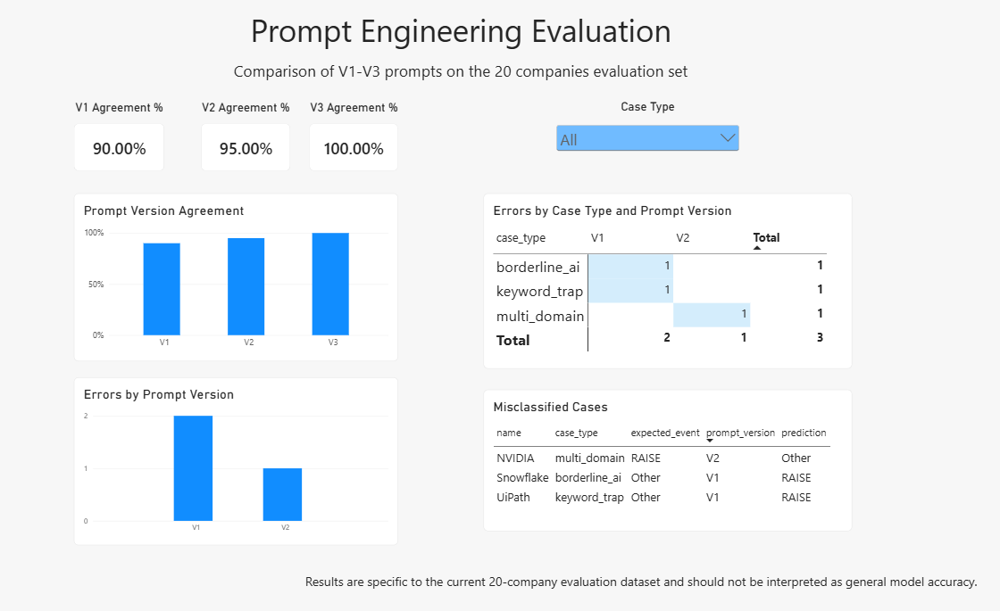

[English](README.md) | Français

# Pipeline de qualification de leads événementiels assisté par IA

Prototype de bout en bout permettant de classer des entreprises selon l’événement technologique le plus pertinent, d’évaluer leur pertinence commerciale et de prioriser les leads pour la prospection.

## Sommaire

- [Présentation du projet](#présentation-du-projet)
- [Architecture du pipeline](#architecture-du-pipeline)
- [Structure du projet](#structure-du-projet)
- [Prompt engineering](#prompt-engineering)
- [Résultats de l’évaluation des prompts](#résultats-de-lévaluation-des-prompts)
- [Sorties structurées](#sorties-structurées)
- [Conception de la base de données](#conception-de-la-base-de-données)
- [Modèle de scoring des leads](#modèle-de-scoring-des-leads)
- [Exemple de résultats](#exemple-de-résultats)
- [Exemples de requêtes métier](#exemples-de-requêtes-métier)
- [Exécution du projet](#exécution-du-projet)
- [Automatisation n8n](#automatisation-n8n)
- [Tableau de bord Power BI](#tableau-de-bord-power-bi)
- [Limites des données](#limites-des-données)
- [Améliorations futures](#améliorations-futures)
- [Stack technique](#stack-technique)

---

**Points clés**

- Classe 20 entreprises en RAISE, Signal Week, MACHINA ou Other grâce aux OpenAI Structured Outputs
- Évalue trois versions de prompt par rapport aux labels attendus : 90 % → 95 % → 100 % de concordance (agreement) sur le jeu de 20 entreprises
- Calcule le score des leads en combinant `relevance_score` et des variables métier simulées ; la définition du score a été corrigée après avoir faussé les priorités ([détails](#définition-du-relevance-score))
- Fonctionne sous forme de pipeline batch (Python, SQLite, pandas), de workflow n8n en temps réel et de tableau de bord Power BI en deux pages

---

## Présentation du projet

Les organisateurs d’événements peuvent recevoir de longues listes d’entreprises à associer à l’événement le plus pertinent, puis à prioriser pour le développement commercial.

Ce projet automatise une partie de ce processus.

Chaque entreprise est classée dans l’une des quatre catégories d’événements suivantes :

- **RAISE** — IA, IA générative, machine learning, infrastructure d’IA
- **Signal Week** — blockchain, crypto, Web3, actifs numériques
- **MACHINA** — robotique, IA physique, machines autonomes, IA incarnée (embodied AI)
- **Other** — entreprises qui ne correspondent clairement à aucune des trois catégories d’événements

Le pipeline combine ensuite la classification produite par l’IA avec des variables métier simulées pour calculer un lead score, attribuer un niveau de priorité et recommander une action de suivi.

---

## Architecture du pipeline

```text
companies.csv
    ↓
Table SQLite companies
    ↓
OpenAI API
    ↓
Sortie de classification structurée
    ↓
Table classifications
    ↓
Logique de scoring métier
    ↓
Table lead_scores
    ↓
Analyses SQL + analyse pandas
    ↓
Résultats de qualification des leads
    ↓
Tableau de bord Power BI
```

Le projet sépare l’expérimentation, la classification destinée à un usage de type production, le traitement de la base de données et l’analyse dans des modules distincts.

---

## Structure du projet

```text
event-lead-qualification/
├── docs/
│   ├── n8n_workflow.png
│   ├── powerbi_dashboard.png
│   └── powerbi_prompt_evaluation.png
├── n8n/
│   └── event_lead_qualification_workflow.json
├── powerbi/
│   └── event_lead_qualification_dashboard.pbix
├── companies.csv
├── openai_classifier.py
├── prompt_evaluation.py
├── database.py
├── lead_qualification.py
├── requirements.txt
├── .gitignore
├── README.md
└── README.fr.md

Générés après l’exécution des scripts (ignorés par Git, non commités) :

event_leads.db                          ← database.py
lead_qualification_results.csv          ← lead_qualification.py
top_10_leads.csv
top_leads_by_event.csv
priority_leads.csv
event_summary.csv
priority_summary.csv
classification_errors.csv
lead_qualification_case_summary.csv
prompt_evaluation.csv                   ← prompt_evaluation.py
prompt_evaluation_case_summary.csv
fixed_by_v2.csv
experiment_summary.csv
```

Chaque module a un rôle précis : `openai_classifier.py` gère la classification avec des sorties structurées validées, `prompt_evaluation.py` compare les trois versions de prompt, `database.py` exécute le pipeline SQLite de stockage et de scoring, et `lead_qualification.py` réalise l’analyse pandas et les exports.

---

## Prompt engineering

Trois versions de prompt ont été testées.

### V1 — Prompt de classification de base

La première version fournissait uniquement les définitions des événements et demandait au modèle de choisir une catégorie.

### V2 — Règles centrées sur l’activité principale

La deuxième version introduisait des règles plus strictes, par exemple :

- classer l’entreprise selon son activité principale
- ne pas se fier uniquement aux mots-clés technologiques
- utiliser Other lorsqu’aucune catégorie ne s’applique clairement

### V3 — Règles de décision explicites

La version finale ajoute des règles plus précises pour les cas ambigus.

Exemples :

- l’automatisation logicielle de processus (robotic process automation) ne doit pas être classée en MACHINA
- les entreprises de fintech ou de paiement généralistes ne doivent pas être classées automatiquement en Signal Week
- des capacités d’IA ne doivent pas impliquer automatiquement RAISE lorsque l’IA n’est qu’une fonctionnalité additionnelle
- la robotique physique est prioritaire sur l’IA généraliste lorsque le produit principal de l’entreprise est un système robotique ou autonome

Les règles de décision de la V3 sont également utilisées par le classifieur de production.

### Définition du relevance score

Les prompts d’évaluation (V1–V3) déterminent uniquement à quel événement appartient une entreprise. Le classifieur de production renvoie en plus un `relevance_score` ; or, dans une version initiale de son prompt, seule la plage de valeurs était contrainte, pas la signification du score.

Le modèle interprétait le score comme un niveau de confiance dans la classification plutôt que comme la pertinence par rapport à l’événement. Des entreprises classées `Other` recevaient des scores allant jusqu’à 10, alors que leur propre `reason` indiquait qu’aucun thème d’événement n’était central dans leur activité. Comme `relevance_score` pèse 30 % du lead score, cela faisait remonter des entreprises hors cible dans la tranche de priorité Medium.

Le prompt de production définit désormais le score comme la pertinence par rapport à l’événement attribué, et non comme la confiance dans la classification :

```text
- 8-10: the event topic is the company's primary business
- 5-7:  the company fits the event, but the relevant technology is only
        one part of a broader business
- 2-4:  the company has only a marginal connection to the event topics
- 1:    the company has no meaningful connection to any event topic

If the event is Other, relevance_score must be 3 or lower.
```

Ce changement a modifié le scoring, mais pas la classification. Les 20 entreprises ont conservé le même événement prédit, et toutes les entreprises `Other` se situent désormais dans la tranche de priorité Low. Les entreprises multi-domaines comme NVIDIA et Tesla sont passées de 9–10 à 7, car le thème de l’événement ne représente qu’une partie de leur activité.

La règle `Other` est appliquée dans le code, et pas seulement dans le prompt. Le modèle Pydantic rejette toute classification `Other` dont le score dépasse 3, et le nœud n8n `Validate AI Output` applique la même vérification. Le prompt de classification n8n contient la même définition de la pertinence : le scoring batch et le scoring en temps réel reposent donc sur la même sémantique.

---

## Résultats de l’évaluation des prompts

Les prompts ont été évalués sur un jeu de test de 20 entreprises, avec des labels attendus attribués manuellement.

| Version du prompt | Concordance avec le label attendu |
|---------------|-------------------------------|
| V1 | 90 % |
| V2 | 95 % |
| V3 | 100 % |

- La V1 a mal classé UiPath et Snowflake.
- La V2 a corrigé ces deux erreurs, mais a introduit une nouvelle erreur sur NVIDIA.
- La V3 a corrigé NVIDIA et n’a introduit aucune nouvelle erreur sur ce jeu de test.

> Les règles de la V3 ont été développées sur ces mêmes 20 entreprises. Les chiffres mesurent la concordance (agreement) avec les labels attendus sur ce jeu de test et ne doivent pas être interprétés comme une précision (accuracy) générale du modèle.

---

## Sorties structurées

Le classifieur de production valide les réponses d’OpenAI avec un modèle Pydantic.

```python
class ClassificationResult(BaseModel):
    event: Literal[
        "RAISE",
        "Signal Week",
        "MACHINA",
        "Other"
    ]

    relevance_score: int = Field(
        ge=1,
        le=10
    )

    reason: str

    @model_validator(mode="after")
    def other_requires_low_relevance(self):
        if self.event == "Other" and self.relevance_score > 3:
            raise ValueError(
                "relevance_score must be 3 or lower when event is Other"
            )
        return self
```

Cela garantit que les étapes en aval (base de données et analyses) reçoivent des données prévisibles et validées. Une réponse qui échoue à la validation est comptée comme une classification en échec (voir [Exécuter le pipeline de base de données](#exécuter-le-pipeline-de-base-de-données)).

---

## Conception de la base de données

La base SQLite contient trois tables principales.

### `companies`

Stocke les données sources des entreprises et leurs variables métier.

Exemples :

- name
- description
- expected_event
- case_type
- company_size
- industry_fit
- past_event_engagement
- sponsorship_potential

### `classifications`

Stocke les résultats de la classification par l’IA.

- company_id
- predicted_event
- relevance_score
- reason
- correct

### `lead_scores`

Stocke les résultats de la qualification métier.

- company_id
- lead_score
- priority
- recommended_action

Les tables sont reliées par `company_id`.

Relancer `database.py` met à jour les entreprises existantes à partir de `companies.csv` (rapprochement sur `name`) et resynchronise l’indicateur `correct` stocké avec l’`expected_event` actuel. Les entreprises retirées du CSV ne sont pas supprimées de la base ; supprimez `event_leads.db` et relancez avec `RUN_CLASSIFICATION = True` pour la reconstruire.

---

## Modèle de scoring des leads

Le lead score combine le `relevance_score` issu de l’IA avec des variables métier.

```text
Lead Score =
    relevance_score × 30%
  + industry_fit × 25%
  + sponsorship_potential × 20%
  + company_size × 10%
  + past_event_engagement × 10%
  + case_confidence × 5%
```

Les six entrées utilisent une échelle de 1 à 10 et la somme des poids est égale à 100 %, ce qui donne des scores compris entre 10 et 100.

`relevance_score` est la seule entrée produite par le classifieur. Sa définition est décrite dans [Définition du relevance score](#définition-du-relevance-score), car une échelle mal définie fausse l’ensemble du classement.

---

## Exemple de résultats

Exemples de leads qualifiés :

| Entreprise | Événement | Relevance Score | Lead Score | Priorité | Action recommandée |
|---|---|---:|---:|---|---|
| Binance | Signal Week | 10 | 95.0 | High | Contact sales / partnership team |
| Coinbase | Signal Week | 10 | 95.0 | High | Contact sales / partnership team |
| ABB Robotics | MACHINA | 10 | 93.0 | High | Contact sales / partnership team |
| Scale AI | RAISE | 10 | 93.0 | High | Contact sales / partnership team |
| NVIDIA | RAISE | 7 | 86.5 | High | Contact sales / partnership team |
| Tesla | MACHINA | 7 | 80.0 | Medium | Add to nurture campaign |
| PayPal | Other | 1 | 49.0 | Low | Low priority / monitor |

Les trois dernières lignes illustrent l’échelle de pertinence en action. NVIDIA et Tesla correspondent à leur événement mais s’adressent à plusieurs marchés : elles obtiennent donc 7 plutôt que 10. PayPal est classée `Other` et obtient 1, ce qui l’exclut de la file de prospection malgré sa taille et son potentiel de sponsoring élevés.

### Règles de priorité

```text
85–100   → High
65–84.9  → Medium
<65      → Low
```

### Actions recommandées

```text
High    → Contact sales / partnership team
Medium  → Add to nurture campaign
Low     → Low priority / monitor
```

---

## Exemples de requêtes métier

Le pipeline SQLite permet d’exécuter des requêtes telles que :

```sql
SELECT
    c.name,
    cl.predicted_event,
    ls.lead_score,
    ls.priority
FROM companies AS c
JOIN classifications AS cl
    ON c.id = cl.company_id
JOIN lead_scores AS ls
    ON c.id = ls.company_id
WHERE ls.priority = 'High'
ORDER BY ls.lead_score DESC;
```

Autres analyses possibles :

- score moyen des leads par événement
- nombre de leads par niveau de priorité
- concordance de la classification avec les labels attendus
- sélection des leads à priorité High

---

## Exécution du projet

### Installer les dépendances

```bash
pip install -r requirements.txt
```

### Configurer la clé API OpenAI

Stockez la clé API dans une variable d’environnement. Ne l’écrivez jamais en dur dans le code et ne la commitez jamais sur GitHub.

La clé n’est nécessaire que lorsque la classification est exécutée (`RUN_CLASSIFICATION = True`) et pour `prompt_evaluation.py`. Réutiliser les résultats déjà stockés ne la requiert pas.

**Windows PowerShell**

```powershell
$env:OPENAI_API_KEY="your_api_key"
```

---

### Exécuter le pipeline de base de données

```bash
python database.py
```

Le flag `RUN_CLASSIFICATION` de `database.py` détermine si le classifieur OpenAI est exécuté :

- `False` — réutilise les résultats de classification déjà stockés dans SQLite
- `True` — relance le classifieur OpenAI et met à jour les résultats stockés

`event_leads.db` est ignoré par Git : **la première exécution doit donc se faire avec `RUN_CLASSIFICATION = True`**. Avec `False` et sans classification stockée, le script s’arrête avec une erreur qui liste les entreprises non classées, au lieu de produire des résultats vides.

Le pipeline refuse de continuer si les classifications sont incomplètes ou si les entrées du scoring sont invalides. Les classifications stockées ne sont remplacées que si toutes les entreprises sont classées avec succès (un résultat `Other` avec un score supérieur à 3 compte comme un échec) ; une entreprise ajoutée à `companies.csv` doit être classée avant que le scoring ne s’exécute ; et un `case_type` inconnu interrompt le scoring. Dans chacun de ces cas, le script se termine avec une erreur et laisse les résultats précédents inchangés.

---

### Exécuter l’analyse pandas

```bash
python lead_qualification.py
```

---

### Lancer les expériences sur les prompts

```bash
python prompt_evaluation.py
```

Ce script évalue les prompts V1, V2 et V3 avec de vrais appels à l’OpenAI API. L’exécution complète sur les 20 entreprises représente environ 60 requêtes au modèle (chaque entreprise est évaluée avec les trois versions de prompt).

---

### Ouvrir le tableau de bord

```text
powerbi/event_lead_qualification_dashboard.pbix
```

Les données sont importées dans le rapport ; les scripts ci-dessus ne sont donc nécessaires que pour l’actualiser. Voir [Tableau de bord Power BI](#tableau-de-bord-power-bi).

---

## Automatisation n8n

En complément du pipeline batch (`database.py` / `lead_qualification.py`), le projet inclut un workflow n8n (`n8n/event_lead_qualification_workflow.json`) qui qualifie un lead unique en temps réel lorsqu’il est soumis via un webhook.



```text
Webhook (POST /event-lead)
    ↓
Edit Fields (associe le corps de la requête aux champs)
    ↓
Validate Input (champs obligatoires + plages numériques 1–10)
    ↓
Input Valid? ──No──→ Log Input Error (data table)
    │Yes
    ↓
OpenAI Classification (règles de décision V3 + définition du relevance score)
    ↓
Parse Classification (analyse le JSON, enregistre les erreurs d’analyse)
    ↓
Validate AI Output (erreurs d’analyse / event / relevance_score / reason / Other ≤ 3)
    ↓
AI Output Valid? ──No──→ Log AI Error → Reject AI Output
    │Yes
    ↓
Calculate Lead Score (formule pondérée → priority + recommended_action)
    ↓
IF Priority == High ──Yes──→ Discord Alert
    │No
    ↓
No Operation (aucune action)
```

Principaux choix de conception :

- **Double validation.** Les données d’entrée sont validées avant l’appel à OpenAI, puis la sortie du modèle est de nouveau validée avant le scoring. Les entrées invalides et les sorties de modèle invalides (réponses non parsables ou absentes, scores hors plage, ou résultat `Other` avec un score supérieur à 3) sont écrites dans la data table `error_logs` au lieu d’entrer dans le pipeline de scoring.
- **Même logique de scoring qu’en Python.** Le nœud `Calculate Lead Score` réimplémente la formule pondérée identique à celle de `database.py`, et le prompt de classification contient la même définition du relevance score : les résultats batch et temps réel restent donc cohérents.
- **Alertes sur les leads à priorité élevée.** Lorsque `priority` vaut `High`, un message Discord est envoyé avec le nom de l’entreprise, l’événement, le lead score, le relevance score et la raison ; sinon, l’exécution se termine sans action (no-op).
- **Cas d’usage.** Le workflow complète le pipeline batch : les scripts batch analysent une liste d’entreprises existante, tandis que le webhook qualifie les nouveaux leads à mesure qu’ils arrivent (par exemple depuis un formulaire d’inscription ou un déclencheur CRM).
- **Limites.** Le webhook n’est pas authentifié et répond immédiatement : les appelants ne voient donc pas les rejets. Un échec de l’appel OpenAI lui-même (par exemple une limite de débit) interrompt l’exécution et n’est pas écrit dans `error_logs`.

### Importer le workflow

L’export versionné est anonymisé et utilise des placeholders pour les credentials et les identifiants d’infrastructure. Après l’import, sélectionnez vos propres credentials OpenAI et Discord, le serveur et le canal Discord, ainsi qu’une data table `error_logs` (colonnes `error_type`, `company_name`, `error_message`, `raw_data`).

---

## Tableau de bord Power BI

`powerbi/event_lead_qualification_dashboard.pbix` est un rapport de deux pages construit à partir des sorties du pipeline pour l’analyse de développement commercial.

### Modèle de données

Le rapport utilise deux tables au niveau du détail :

| Table | Source | Granularité |
|---|---|---|
| `lead_qualification_results` | `lead_qualification_results.csv` | une ligne par entreprise |
| `prompt_evaluation_long` | `prompt_evaluation.csv`, dépivoté dans Power Query | une ligne par entreprise et par version de prompt |

Les exports pré-agrégés tels que `top_10_leads.csv`, `event_summary.csv`, `priority_summary.csv` et `top_leads_by_event.csv` ne sont pas importés. Les comptages, moyennes et classements sont calculés en DAX, afin que les visuels réagissent aux filtres.

### Page 1 — Vue d’ensemble des leads



La page comprend quatre mesures KPI :

```dax
Total Leads =
COUNTROWS('lead_qualification_results')

Average Lead Score =
AVERAGE('lead_qualification_results'[lead_score])

High Priority Leads =
CALCULATE(
    [Total Leads],
    'lead_qualification_results'[priority] = "High"
)

Classification Agreement % =
DIVIDE(
    CALCULATE(
        [Total Leads],
        'lead_qualification_results'[correct] = 1
    ),
    [Total Leads]
)
```

D’autres visuels couvrent :

- la répartition des leads par priorité
- les leads par événement
- le score moyen des leads par événement
- les leads les mieux qualifiés
- le potentiel de sponsoring vs. le lead score

Le nuage de points montre aussi l’effet de la révision du `relevance_score` : les entreprises `Other` forment un groupe distinct aux scores plus bas.

### Page 2 — Évaluation des prompts



Cette page compare les trois versions de prompt à travers :

- la concordance (agreement) V1 / V2 / V3
- les erreurs par version de prompt
- les erreurs par type de cas (case type)
- les cas mal classés

Le rapport utilise le terme **Agreement** (concordance) plutôt qu’**Accuracy**, car les résultats sont propres au jeu d’évaluation actuel de 20 entreprises.

### Actualiser le rapport

Le fichier `.pbix` contient les données importées et peut être ouvert directement.

Pour l’actualiser, régénérez d’abord les sorties ignorées par Git :

```bash
python database.py
python lead_qualification.py
python prompt_evaluation.py
```

La première exécution de `database.py` nécessite `RUN_CLASSIFICATION = True`.

Utilisez ensuite **Home → Refresh** (**Accueil → Actualiser** dans l’interface en français) dans Power BI. Les chemins des sources de données étant locaux, il peut être nécessaire de les reconfigurer après avoir cloné le dépôt.

---

## Limites des données

Les descriptions d’entreprises et les labels d’événements sont des données de prototype utilisées pour l’évaluation.

Les variables métier suivantes sont simulées :

- company_size
- industry_fit
- past_event_engagement
- sponsorship_potential
- case_confidence

`case_confidence` est dérivée du `case_type` attribué manuellement à chaque entreprise (un label de difficulté issu du jeu d’évaluation) via une table de correspondance fixe. Les leads réels n’ont pas ce label : le workflow n8n attend donc que l’appelant fournisse cette valeur.

En production, ces champs proviendraient de systèmes tels que :

- des plateformes CRM
- l’historique des événements
- des bases de données d’entreprises
- des API d’enrichissement

Les poids du lead scoring sont heuristiques : ils servent à démontrer la logique métier du pipeline et ne constituent pas un modèle de scoring validé de façon objective.

---

## Améliorations futures

Prochaines étapes possibles :

- connecter un CRM ou des API d’enrichissement
- ajouter des mécanismes de nouvelle tentative (retry) et de gestion des limites de débit pour les appels d’API
- élargir le jeu de données d’évaluation
- ajouter des tests automatisés
- déplacer l’actualisation de Power BI vers une source de données hébergée plutôt que des fichiers CSV locaux

---

## Stack technique

- Python
- pandas
- OpenAI API
- Pydantic
- SQLite
- SQL
- n8n (automatisation de workflows)
- Discord API (alertes)
- Power BI / DAX / Power Query
- Git / GitHub
